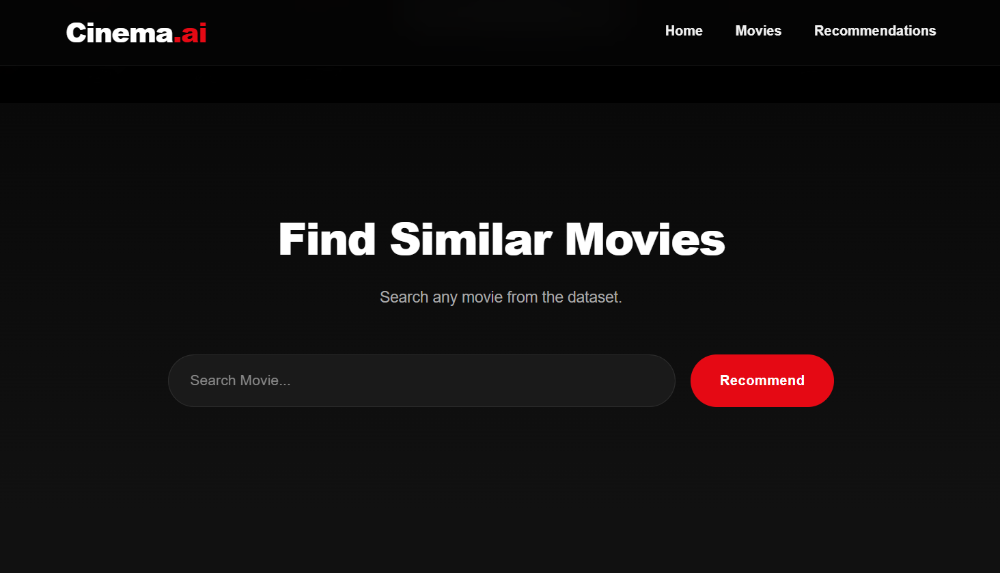
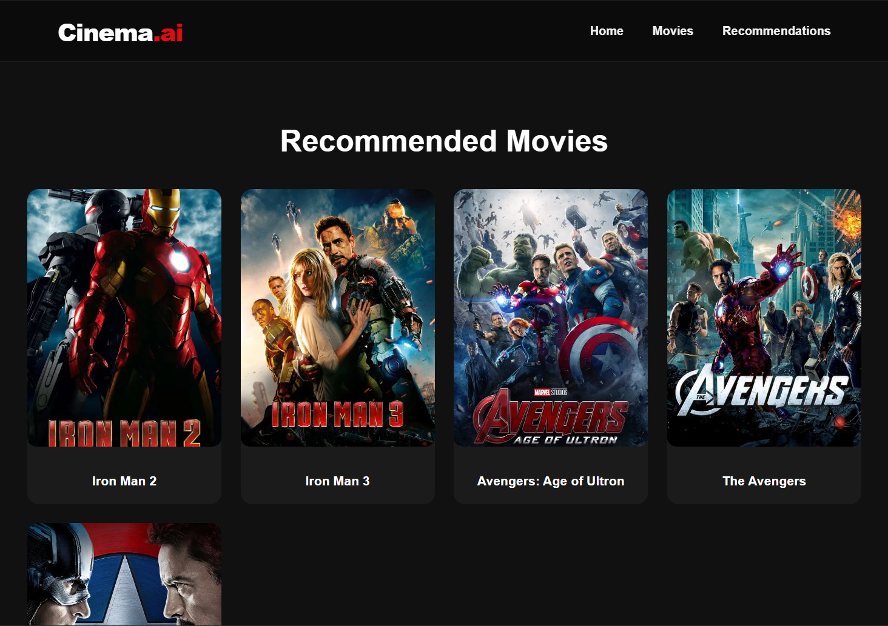

# 🎬 Cinema.ai- AI Powered Movie Recommendation System

Cinema.ai is a **Content-Based Movie Recommendation System** built using **Machine Learning**, **Flask**, and **React**. It recommends movies similar to a user's selection by analyzing movie metadata such as genres, cast, crew, keywords, and overview.

---

## 📖 Overview

Finding your next favorite movie can be overwhelming with thousands of available titles. CineMatch simplifies this by recommending movies that share similar content with the selected movie.

The recommendation engine uses **Content-Based Filtering** powered by **Cosine Similarity**, while the web application is built with **Flask** (backend) and **React** (frontend).

---

## ✨ Features

- 🔍 Search movies with autocomplete suggestions
- 🎯 Get Top 5 similar movie recommendations
- 🖼️ Display official movie posters using the TMDB API
- ⚡ Fast recommendation engine using a precomputed similarity matrix
- 🌙 Modern dark-themed responsive UI
- 📱 Fully responsive design
- 🚀 Flask REST API backend
- ⚛️ React frontend

---

## 🛠️ Tech Stack

### Machine Learning
- Python
- Pandas
- NumPy
- Scikit-learn
- CountVectorizer
- Cosine Similarity

### Backend
- Flask
- Flask-CORS
- Requests
- Python-dotenv

### Frontend
- React.js
- Axios
- CSS3

### Dataset
- TMDB 5000 Movies Dataset

---

## 📂 Project Structure

```
CineMatch/
│
├── backend/
│   ├── app.py
│   ├── movies.pkl
│   ├── requirements.txt
│   └── ...
│
├── frontend/
│   ├── src/
│   ├── public/
│   ├── package.json
│   └── ...
│
├── Movie_Recommendation.ipynb
├── movies.csv
├── README.md
├── .gitignore
└── screenshots/
```

---


## 📸 Screenshots

| Home Page | Search Suggestions |
|-----------|-------------------|
|  |  |

### Movie Recommendations




---

## 🧠 Machine Learning Workflow

1. Load movie dataset
2. Clean and preprocess the data
3. Feature engineering
4. Create movie tags
5. Convert text into vectors using CountVectorizer
6. Compute Cosine Similarity
7. Save processed data using Pickle
8. Build Flask API
9. Develop React frontend
10. Display movie recommendations with posters

---

## 🚀 Installation

### 1️⃣ Clone the repository

```bash
git clone https://github.com/Abinbaby-24/movie-rec.git
```

---

### 2️⃣ Backend Setup

```bash
cd backend

pip install -r requirements.txt

python app.py
```

Backend runs on

```
http://127.0.0.1:5000
```

---

### 3️⃣ Frontend Setup

```bash
cd frontend

npm install

npm run dev
```

Frontend runs on

```
http://localhost:5173
```

---

## 🔑 TMDB API Configuration

Create a `.env` file in the project root:

```env
TMDB_API_KEY=YOUR_TMDB_API_KEY
```

The backend automatically loads the API key using `python-dotenv`.

---

## 📡 API Endpoints

### Get All Movies

```
GET /movies
```

Response

```json
[
  "Avatar",
  "Titanic",
  "The Dark Knight"
]
```

---

### Recommend Movies

```
POST /recommend
```

Request

```json
{
    "movie":"Avatar"
}
```

Response

```json
[
  {
    "title":"John Carter",
    "poster":"https://image.tmdb.org/t/p/w500/..."
  },
  {
    "title":"Guardians of the Galaxy",
    "poster":"https://image.tmdb.org/t/p/w500/..."
  }
]
```


### Movie Recommendations


---

## 📊 Dataset

This project uses the **TMDB 5000 Movies Dataset**.

The recommendation model utilizes:

- Genres
- Keywords
- Cast
- Crew
- Director
- Movie Overview

to compute movie similarity.

---

## 📦 Dependencies

Install all dependencies using:

```bash
pip install -r requirements.txt
```

Frontend dependencies:

```bash
npm install
```

---

## ⚠️ Notes

- `similarity.pkl` is intentionally excluded from this repository because it exceeds GitHub's 100 MB file size limit.
- Run the Jupyter Notebook (`Movie_Recommendation.ipynb`) to regenerate the similarity matrix if needed.
- A TMDB API key is required to fetch movie posters.

---

## 🔮 Future Improvements

- ⭐ User ratings and reviews
- ❤️ Save favorite movies
- 🎭 Genre-based filtering
- 🎬 Movie trailers
- 📈 Trending and popular movies
- 🤖 Hybrid Recommendation System
- ☁️ Deploy using Render & Vercel

---

## 👨‍💻 Author

**Abin Baby**

B.Tech Computer Science and Engineering  
College of Engineering Cherthala

- GitHub: https://github.com/Abinbaby-24
- LinkedIn: https://www.linkedin.com/in/abin-baby-0001-

---

## 🙏 Acknowledgements

- TMDB for providing movie metadata and poster API.
- Scikit-learn for machine learning tools.
- Flask and React communities for excellent documentation.

---

## 📄 License

This project is licensed under the MIT License.

---

⭐ If you found this project helpful, consider giving it a **Star** on GitHub!
